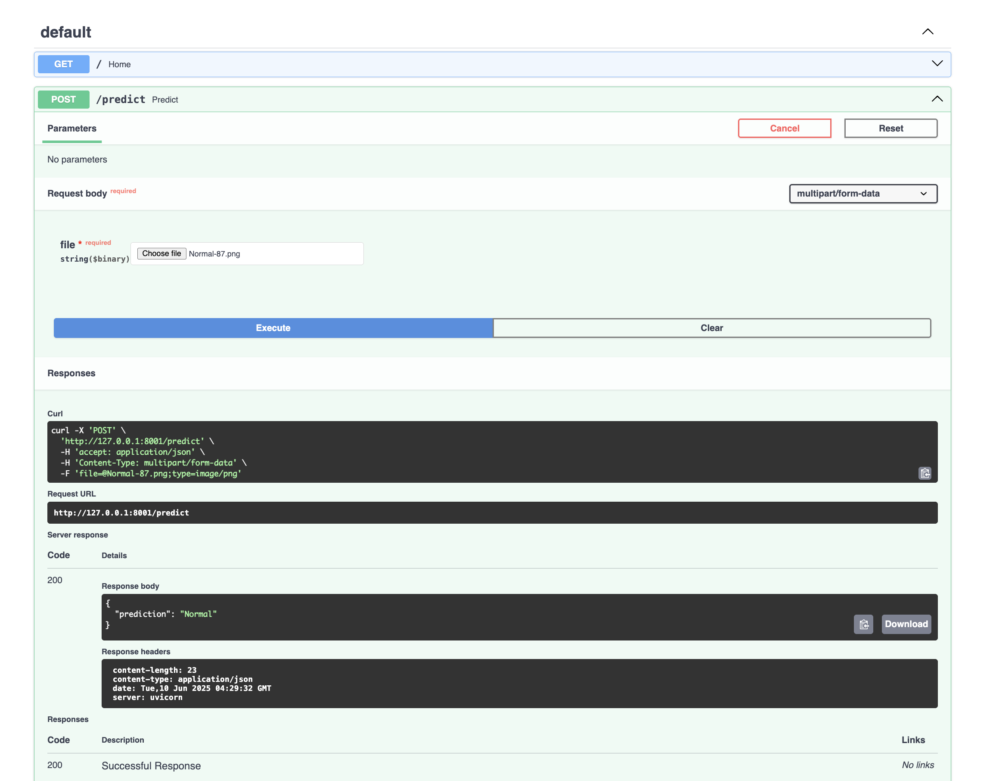
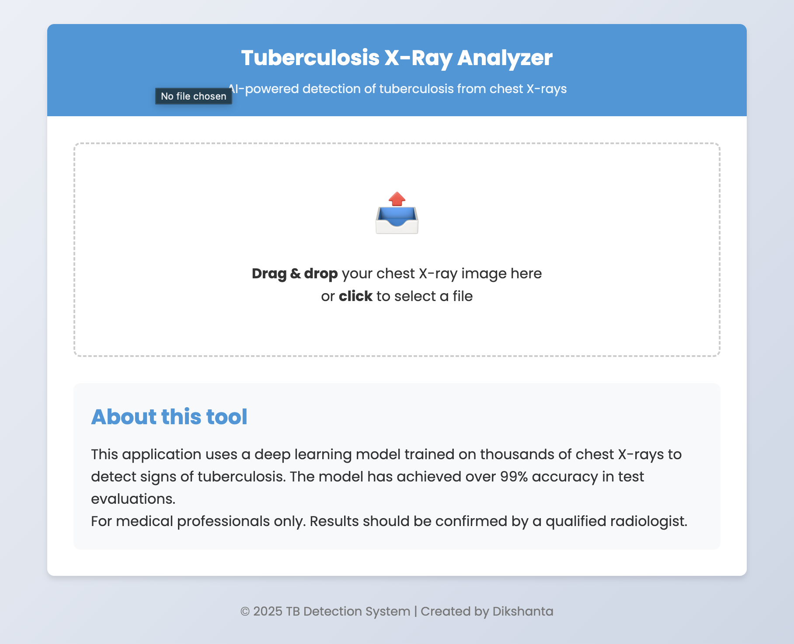
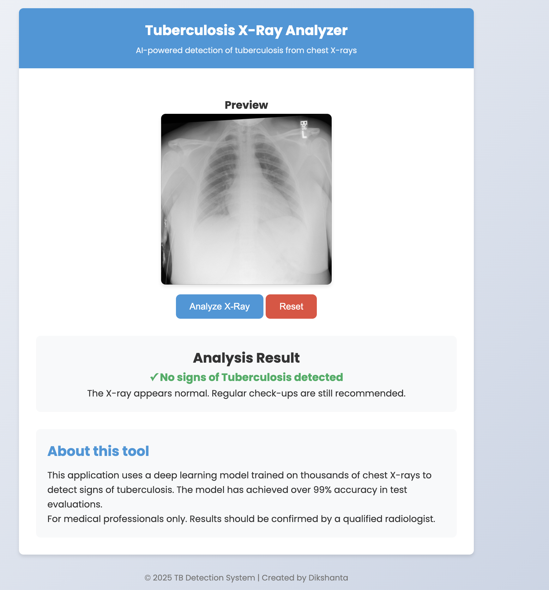
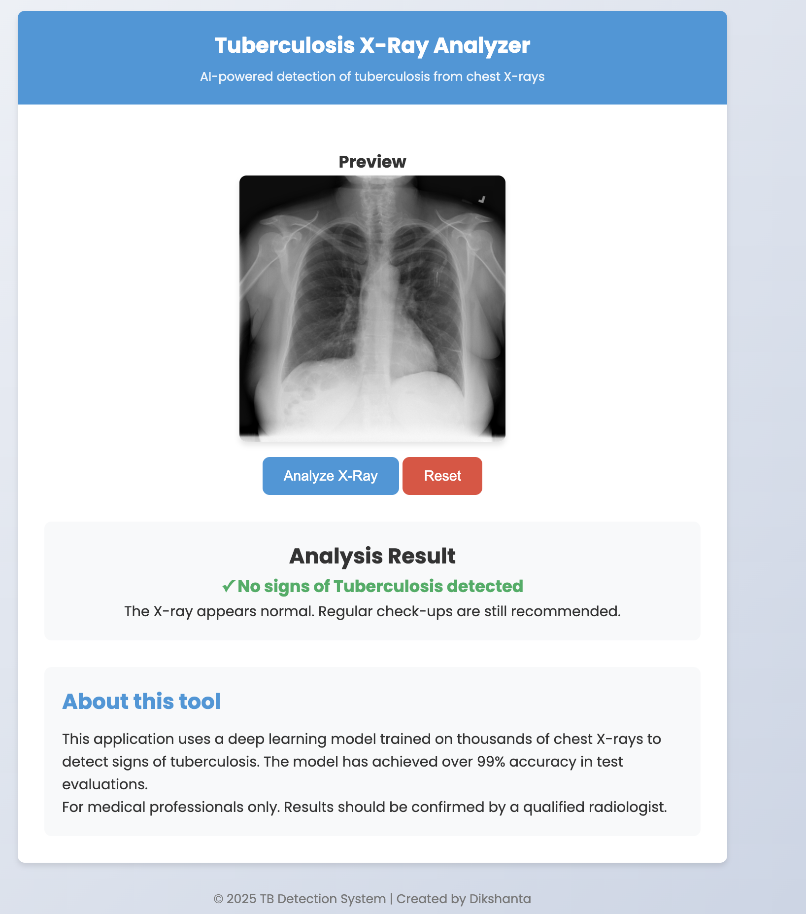

🚨 Tuberculosis X-Ray Prediction API

A deep learning project to detect Tuberculosis (TB) from chest X-ray images using a Convolutional Neural Network (CNN) built with PyTorch. This repository also includes a FastAPI-based REST API linked with a simple HTML, CSS, and JavaScript frontend to upload X-ray images and display predictions directly on the web page.

---

🚀 Project Overview

This project uses a CNN to classify chest X-ray images as either **Normal** or **Tuberculosis Positive**. The model is trained on labeled chest X-ray images, and evaluation metrics such as accuracy, confusion matrix, precision, recall, and F1-score are computed to assess the performance.

The FastAPI service provides an easy-to-use interface for uploading chest X-ray images and receiving TB prediction results in real-time. It is integrated with a frontend built with HTML, CSS, and JavaScript that allows users to upload images through a web page, send them to the backend API, and display the prediction results immediately.

---

🧠 Model Architecture

* CNN Model: A simple two-layer convolutional network with max pooling and fully connected layers.
* Input images resized to 224x224 pixels.
* Outputs binary classification: 0 = Normal, 1 = TB Positive.
* Trained with CrossEntropyLoss and Adam optimizer.

---

📊 Model Training and Evaluation

* Dataset split: 80% training, 20% testing.
* Metrics computed on the test set:

  * Accuracy
  * Confusion Matrix (visualized with seaborn heatmap)
  * Precision, Recall, and F1-score can be added for detailed analysis.

---

⚙️ Installation

To install and setup the project, run the following commands:

```bash or terminal 
git clone https://github.com/dabster108/Tuberculosis-X-ray-Prediction.git
cd Tuberculosis-X-ray-Prediction
pip install -r requirements.txt
```

---

🛠 Usage


 Running the API Server with Frontend

Start the FastAPI server that serves both the API and the frontend web page:

```bash
uvicorn main:app --reload
```

The backend will handle image uploads both via API and the web interface.

 Accessing the Frontend

Open your browser and go to:

```
http://localhost:8000/
```



*FastAPI Swagger UI showing API documentation and endpoints.*

You will see a simple web page built with HTML, CSS, and JavaScript where you can:

* Upload chest X-ray images.
* The frontend sends the image to the FastAPI backend.
* The prediction (Normal or TB Positive) will be displayed on the page instantly.


*Web interface for uploading X-ray images (HTML/CSS/JS frontend).*

---

📷 Prediction Examples


*Predicted: Tuberculosis Positive*


*Predicted: Normal*

---

📈 Example Prediction Output from API or Frontend

```json
{
  "prediction": "TB Positive",
}
```

---

📉 Evaluation Metrics

You can extend evaluation by calculating:

* Accuracy: Overall correct predictions / total samples
* Precision: True Positives / (True Positives + False Positives)
* Recall: True Positives / (True Positives + False Negatives)
* F1 Score: Harmonic mean of precision and recall

Using scikit-learn’s `classification_report` can give you these metrics easily.

---

🗂 Dataset Structure

* Normal/ — Folder containing normal chest X-ray images
* Tuberculosis/ — Folder containing TB-positive chest X-ray images

---

⚠️ Notes

* You can replace the CNN model architecture with your own or pretrained models.
* Adjust batch size, learning rate, and number of epochs in the training script as needed.
* The saved model weights (`tuber_model.pth`) are loaded by the API for inference.
* The FastAPI backend supports uploading images via REST API or the integrated web frontend.

---

📜 License

MIT License

---

👤 Author

Dikshanta
GitHub: [https://github.com/dabster108](https://github.com/dabster108)

---

🤝 Contributions

Feel free to open issues or submit pull requests to improve the model, API, or frontend.

---

